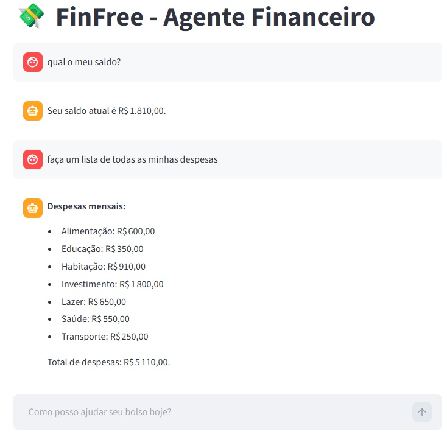

# 🤖 Agente Financeiro Inteligente com IA Generativa
# 💸 FinFree AI - Mentor de Inteligência Financeira

O **FinFree** é um agente de inteligência artificial projetado para democratizar a educação financeira. Ele atua como um mentor personalizado que analisa dados reais de transações, histórico de atendimentos e perfil de risco para oferecer diagnósticos financeiros precisos e recomendações de investimento.

---

<div align="center">
  
  <p><i>Interface do FinFree AI: Registro de transações e histórico de chat com o Agente.</i></p>
</div>

### 📑 Transparência e Rastreabilidade

Conforme demonstrado na interface, o sistema prioriza a clareza das informações:
* **Log de Transações:** Exibição clara de todas as movimentações financeiras, permitindo que o usuário valide os dados que a IA está analisando.
* **Interação Direta:** Sistema de chat que mantém o histórico da conversa visível, facilitando o acompanhamento das orientações financeiras.
* **Identificação de Fluxo:** Colunas específicas para Categoria e Tipo (Entrada/Saída), fundamentais para a auditoria do saldo calculado pelo agente.

---

## 🚀 Funcionalidades Técnicas

* **Memória de Curto e Longo Prazo:** Utiliza um histórico de atendimentos (`.csv`) para manter o fio da meada em conversas contínuas.
* **Contexto Enriquecido:** Algoritmo que totaliza receitas e despesas antes de enviar ao modelo, evitando a "cegueira" de dados por limitação de tokens.
* **Sanitização com Pandas:** Tratamento rigoroso de tipagem de dados (Type Casting) para garantir precisão em cálculos de saldo.
* **Perfil de Investidor Adaptativo:** Cruza as metas financeiras e o apetite a risco (JSON) com o catálogo de produtos disponíveis.
* **Processamento Local:** Focado em privacidade e baixo custo, utilizando modelos via Ollama.

---

## 🛠️ Tecnologias e Ferramentas

* **Linguagem:** [Python 3.10.12](https://www.python.org/)
* **Gestão de Python:** [pyenv](https://github.com/pyenv/pyenv)
* **Gestão de Dependências:** [Poetry](https://python-poetry.org/)
* **IA Engine:** [Ollama](https://ollama.ai/) (Modelo: `llama3.2:1b`)
* **Interface:** [Streamlit](https://streamlit.io/)
* **Análise de Dados:** [Pandas](https://pandas.pydata.org/)

---

## 📂 Estrutura de Diretórios

```text
agente-finfree/
├── assets/                     # Imagens de documentação
├── data/                       # Base de conhecimento local (CSV/JSON)
│   ├── transacoes.csv          # Registro de entradas e saídas
│   ├── perfil_investidor.json  # Dados do cliente
│   ├── produtos_financeiros.json # Catálogo de produtos
│   └── historico_atendimento.csv # Logs de memória do agente
├── src/
│   └── finfree/
│       ├── agente.py           # Core: Lógica, Prompt e Memória
│       └── app.py              # UI: Interface Streamlit
├── pyproject.toml              # Configuração Poetry
└── .env                        # Variáveis de ambiente (ignorado pelo git)
```
## 🔧 Configuração e Instalação
Nesta seção, você encontrará o passo a passo para preparar o ambiente local.

### 1. Requisitos de Ambiente
Certifique-se de ter o pyenv e o Poetry instalados em sua máquina.

### Clonar o repositório
```
bash
git clone https://github.com/seu-usuario/finfree-ai.git
cd finfree-ai 
```

### Configurar a versão correta do Python via pyenv
```
pyenv install 3.10.12
pyenv local 3.10.12
```

### Instalar dependências e criar ambiente virtual via Poetry
```
poetry install
```

## 2. Configuração do Modelo IA (Ollama)
O projeto está otimizado para o modelo Llama 3.2:1b, ideal para execução em hardware doméstico.
```
OLLAMA_URL=http://localhost:11434
OLLAMA_MODEL=llama3.2:1b
```
## Certifique-se que o Ollama está rodando e baixe o modelo
```
ollama pull llama3.2:1b
```
## 🖥️ Execução
Para iniciar o agente financeiro, utilize o comando:
```
Bash
poetry run streamlit run src/finfree/app.py
```
## 🧪 Metodologia de Avaliação
O projeto foi validado utilizando métricas de:

Assertividade: Cálculo exato de saldo real comparando total_entradas vs total_saidas.
Segurança: O agente é instruído a admitir desconhecimento sobre temas fora do escopo financeiro.
Coerência: Recomendações baseadas estritamente no perfil de risco do utilizador.

## 📝 Licença
Distribuído sob a licença MIT. 

Desenvolvido como projeto prático para o desafio de Agentes de IA da DIO. 🚀
